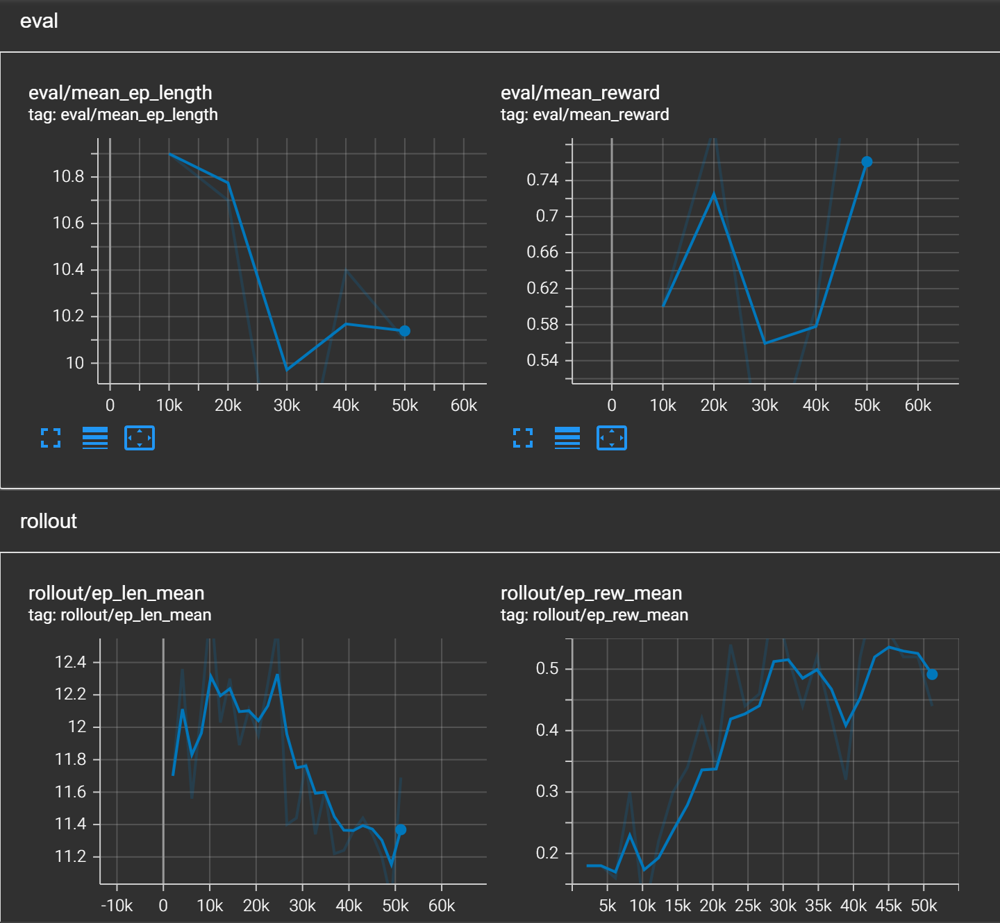
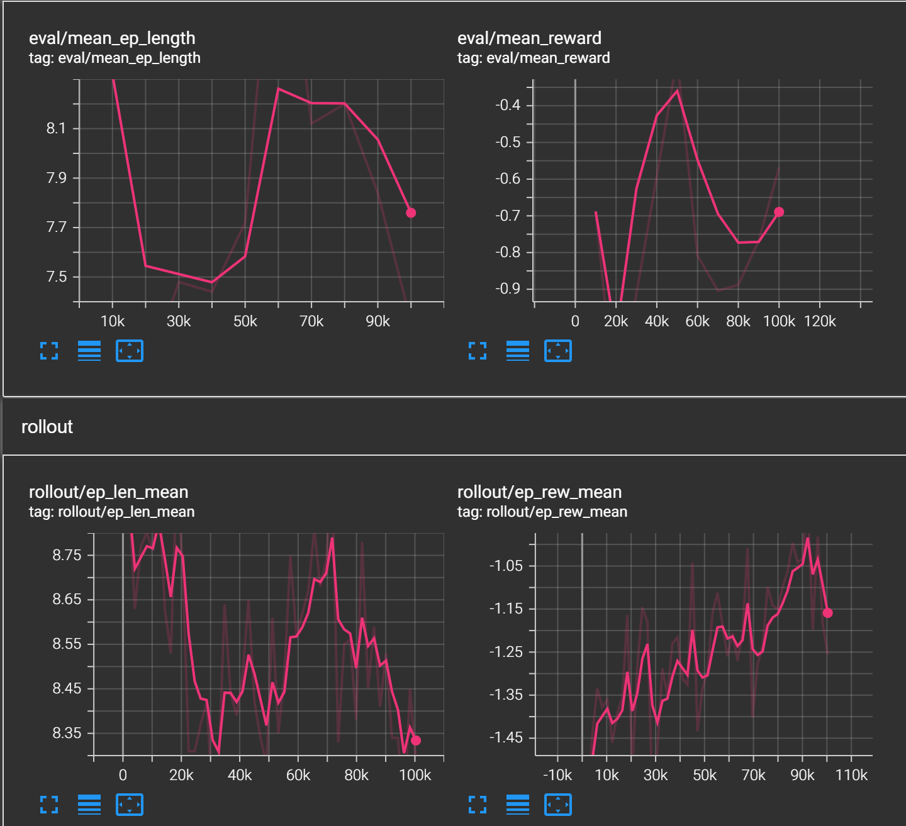
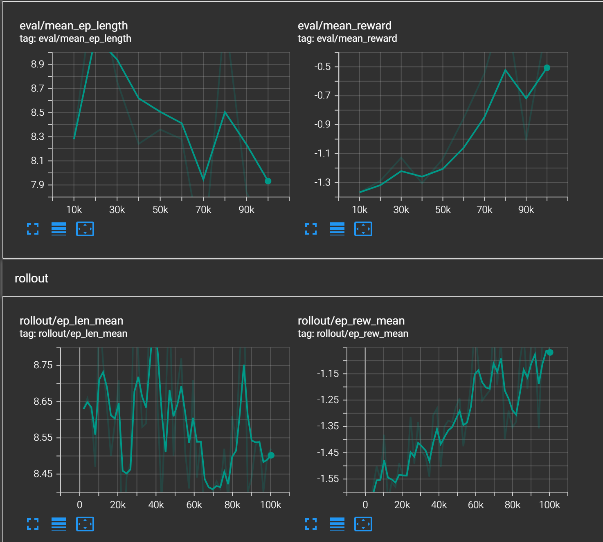
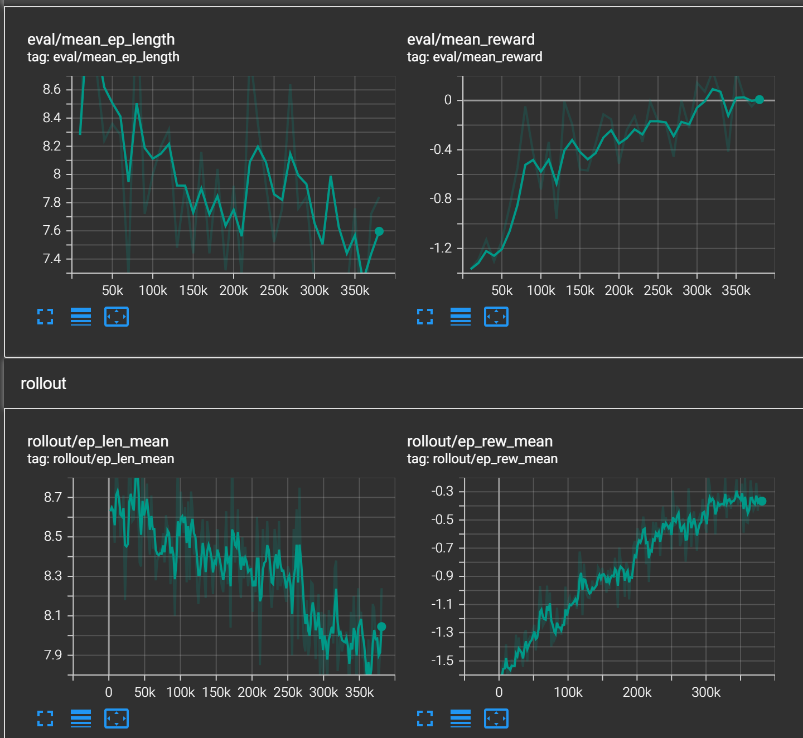
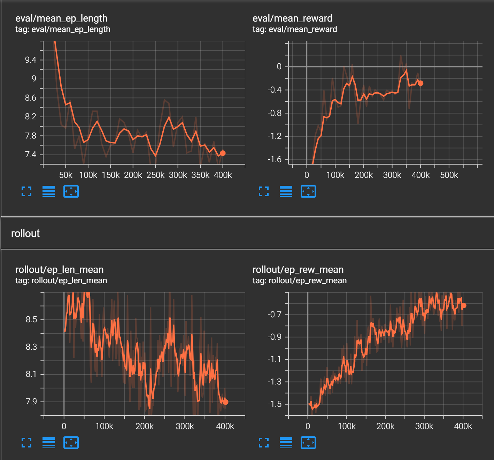

# Work Diary

I will be documenting my thought process and the general changes I have made, along with future plans and whatnot here.

## 2026/9/13

I started this project for a couple of reasons. First, I of course wanted a nice project for my resume. Second, I'm an AI major, so I figured that I should maybe have some more ML/AI related projects anyways. And third, I am a big Pokemon fan, and have wanted to get better at battling for a long time, but playing on the ladder is kind of anxiety-inducing. So, I wanted to solve that.

I've set up a random double battles bot simply to test, and I found that it can do around 135 turns per second, which seems quite good as VGC battles take like 10 turns or so on average assuming that players know to some extent what they're doing. This means around 13 games per second.

I have realized that this is probably a pretty difficult problem to try to tackle. There are simply SO many variables in competitive Pokemon, especially VGC doubles. Of course, this means two things: if I'm able to actually do it, it's all the more impressive, but at the same time, it will be difficult for me to adjust to the learning curve.

## 2026/9/14

I'm gonna start with training a very rudimentary agent. This agent will only really be able to make judgments based on Pokemon's moves, types, stat changes, and field effects. The expectation isn't for it to be *good* at battling, but I do expect that after training, it should be able to at least battle much better than just randomly selecting moves.

I have created the rudimentary state encoder to encode the board state of the current turn, and my next steps will be to actually get an RL agent up and train it.

## 2026/9/15

Well, my next steps were *actually* to encode the action space and to create a kind of helper class to translate the Showdown states into tensors using the state encoder, and to translate the actions returned by the future RL agent into actions on Showdown. Apparently using a `gymnasium.env` is standard for this kind of thing. About the action space though, I think this is somewhat final already, as in, even in the non-simplified agent that I will make after this simplified one, the actions that the agent can possibly take on each turn won't change. I think it's just the observation space and encoded state that will be much more complex.

I kinda wanna document my thought process in some more depth, especially as the action space probably won't change drastically. So initially, I was gonna just use something like a `[14, 14]` Multidiscrete after some digging, representing 14 actions for each Pokemon on the field, namely, 4 moves aimed at 3 potential targets (opponents and ally), plus 2 switches. However, after factoring in mega evolution, I realized that this wouldn't really cut it. Of course, I could've just switched to `[14, 2, 14, 2]` instead, but there was a problem with this: oftentimes for certain teams in VGC battles, especially at the high level, the move you click can depend on whether you mega evolve, and there are situations in which a Pokemon that *can* mega evolve doesn't do so. For example, if you bring both Charizard and Venusaur but end up mega evolving Venusaur, you obviously would be much less likely to click something like solar beam on Charizard, unless for some reason the sun is up anyways. So I thought you couldn't really decouple these things, and so switched to `[26, 26]`. Actually, I realize now that the moves that you click on each Pokemon also depend a good bit on what the other Pokemon clicks often, so I might even have to switch to just a purely discrete action space of like $26^2$, but since I have to rewrite or expand the encoder anyways, I think I'll just stick with what I have as a proof of concept before rewriting in the "real" implementation.

Well I thought about it some more and I actually think I really want to switch, so I'm gonna switch. The thing is, there are just some absolutely disastrous situations that can happen if both Pokemon's moves are decided completely independently of each other. It's actually pretty easy to see why. Say for example that the board state looks something like this:

|            |                      |
|------------|----------------------|
| Garchomp   | Floette-Eternal-Mega |
| Baxcalibur | Froslass-Mega        |

Let's say Froslass uses ice beam or some ice move into Garchomp, and Baxcalibur uses something like glaive rush into Garchomp (not the best example for various reasons, but it works). Froslass, being faster, knocks out the Garchomp, and Baxcalibur's glaive rush, being a dragon type move, does **NOTHING** after being redirected into the only opponent left, the fairy-type Floette. Of course, a real player would never do something like this (above a certain skill level), but the agent, if using a `[26, 26]` state space, is not capable of making the judgment that Froslass will knock out Garchomp, thus Baxcalibur shouldn't use a dragon type move (or double up into Garchomp at all); it simply sees "this move can knock out Garchomp and thus I should click it" for both Pokemon. So, I will be switching over to a normal `Discrete(676)` for the action space, which apparently isn't considered super big, and also the change in my code isn't as tedious as I thought it'd be (basically nothing even changes).

Creating the actual environment isn't too bad once I figured out the requirements for overrides and whatnot, except I literally could not figure out how to deal with the async functions in `poke-env` and how to get the battle state each turn, so I asked an LLM and it came up with something I thought was pretty smart, which was to make use of the `get()` method of `queue` blocking until it can return something. Basically, upon the first turn (and every turn), Showdown calls `choose_move()` to get the orders from each player. So, for our agent, upon `choose_move()` is called, we want to immediately get the board state to encode before any orders are issued. So, we utilize two queues, one for the battle states, and one for the orders, each with max length of 1. Since `step()` in the environment is what issues the actual orders, when we get the orders in `choose_move()` with the `get()` method of the orders queue, it blocks until orders are issued. So, we just put the board state into its queue before returning the order queue `get()`. And, in `step()` (or `reset()` for the initial board state), we call `get()` on the board state queue, which blocks until `choose_move()` is called (i.e. the previous orders were executed and the new board state was calculated by Showdown). This ensures that the environment can get the most updated board state every turn. In order to actually implement this, a custom class that implements `poke-env.player.Player` has to be created that has a custom implementation for `choose_move()`.

## 2026/9/16

I actually never decided on what RL algorithm to use, so I did some digging, and it seems like there are people using DQN in combination with supervised learning, or PPO, or other algorithms. I'm not too knowledgeable in this area, so I just asked an LLM and it said that using a masked PPO is good for this stage (not sure how or if that will change for the "full" implementation later though). Regardless, I need to come up with a reward function for the agent. I think this probably something that doesn't really have an exact science behind it. Of course, the highest reward should be for winning the game and the lowest for losing, something like $+1$ and $-1$ respectively. The difficult part is evaluating the rewards for knocking out a Pokemon, doing a certain amount of damage, inflicting certain status conditions, etc. This is difficult because there may be times where you *prefer* to *not* knock out a Pokemon simply because that Pokemon may be an "island" Pokemon incapable of inflicting offensive pressure on your team, allowing you to set up in front of it, for example. There may also be times where you *want* to be inflicted with a certain status condition to *avoid* being inflicted with a worse one later (for example, if your special attacking Pokemon gets burnt, it may be fine, or good, if the opposing Venusaur wanted to click sleep powder). Although thinking about it, this may be a non-issue, because moves like yawn, toxic, will-o-wisp, etc. are not too common in VGC, and even if they were, setting the rewards/penalties for status conditions in an accordingly increasing manner based on the severity of the status should be fine? Although for burns specifically, it's not too useful to burn a special attacking Pokemon other than getting some chip damage (or negating leftovers or other healing to some extent), but I think this is something the model can learn by itself when it realizes that certain Pokemon getting burnt doesn't affect the outcome very much. But what I am realizing now is that the state space is woefully inadequate for "real" VGC; it will have to be updated to probably include the base power of moves, effects of moves, the actual base stats of the opponent, the actual stats (including EVs) of your own Pokemon, and the agent will need to have some way to remember what happened on previous turns and allow that to influence its decisions. That is for the future however; for now, I will read up on PPO (I sure hope this is still the ideal algorithm to use when I try to increase the observation space and whatnot).

It seems that there are a couple weaknesses of PPO. First of all, it seems that it is somewhat inefficient when it comes to using samples, since it discards after updating weights. This probably isn't too big of an issues since the samples here are just turns in a battle, and the Showdown server should be fast enough as the benchmark was at around 130 or so turns per second. I do expect that this will go down once the network is up and more calculation has to be done on each turn, but with a batch size of 2048 turns, even 21 turns per second on average will let the model do an average of 1 batch every 100 seconds. Second of all, PPO by itself lacks a good mechanism for memory. It does take into account the value function of previous turns, but they may be discounted in GAE by too much to be useful enough. This can also be solved by something called a long short-term memory layer (LSTM layer), apparently, so this is also fine. Third, a "league" of historical checkpoints can be used for training rather than pure self play, since catastrophic forgetting is a problem for many RL models, including PPO, apparently. This actually does make sense though, for the case of Pokemon: if the model learned to play hyper-offense, for example, it may start to learn to play more bulky offense or balance teams if it only played against itself. Then, once the teams get sufficiently bulky, it may start to learn to play hyper-offense again, forgetting the strategy it just learned against hyper-offense.

Another thing I realized is that the critic in PPO for this project probably has to know more than the actor, since it needs to be able to evaluate a board state accurately. So it should probably know what moves the opponent has, what items, abilities, whatnot that usually would be hidden from the player/actor. One thing I am concerned about though, is like what if it's trained against too many teams with scarf Garchomp and learns to treat Garchomp in general as scarfed because of the critic knowing too much? But then I guess that actually kind of does reflect how humans play. If I saw scarf Garchomp like 80 times out of 100 I would probably just assume that a Garchomp that I see is likely scarfed. Or if I don't want that I guess training on unbiased data would work too, but Pokemon teams are kind of always biased because of the meta.

Anyways, I spent like basically all of my time on this project today reading up on PPO. It feels kinda unsatisfying to not have hammered out like 100 lines of code, but I feel like this is a necessary step regardless, so yeah I guess it's acceptable.

## 2026/9/17

I've looked at some of the best principles for designing reward functions. It seems that it's a good idea to start very simple, so maybe I should just start with -1 for a loss and +1 for a win and train before adding stuff for knocking out an opponent's Pokemon and all the other stuff that's probably needed.

So I was running the training loop and found a couple bugs, most of which weren't too easy to fix, just one where Showdown apparently has a forced switch that counts as a turn where you have to issue some `PassBattleOrder` to the slot that's not switching, and then a related one where the fainted Pokemon on that forced switch turn was counted as part of the bench since I wasn't checking for fainted Pokemon when defining the bench. But another issue arose because the evaluation checkpoint was using the same server and accounts (`Player`s) as the training loop, which caused a deadlock due to the blocking nature of the queues in RLPlayer. Apparently the `choose_move()` method *can* actually be `async` which I didn't know. So I've replaced the definition and made use of `asyncio`'s `Future`, which will avoid blocking the entire program, which should fix the issue.

There were a couple more bugs such as when the opponent got a double knockout and the agent only had 1 Pokemon left, there would be an issue where one of the Pokemon would have no legal moves due to the way the action masking was implemented. I've fixed these issues with some help, and now I'm training with the simple reward function of +1 on win, -1 on loss.

Ok, there were actually quite a few bugs in implementation, some of them due to my own stupidity and some due to quirks of Showdown. To be perfectly honest, quite a few of them I had to get "outside help" to fix, but in the end, I was able to run a training run with the following results:



The issue though, is that it's playing a `RandomPlayer`, which is pretty shit at the game, so it doesn't necessarily learn some of the best practices. For example, I noticed that it doesn't mega evolve very often, likely because it won without it anyways and thus never learned to do so. Thinking about it, mega evolution is kind of difficult because it can't be rewarded otherwise the agent would probably just mega evolve as soon as possible, but if it's not rewarded the agent would somehow have to just learn when to mega evolve.

I ran the best model I got training against the `RandomPlayer` against a `SimpleHeuristicPlayer`, and as expected, it got destroyed. I tried training against it next and it kind of didn't really get better, so I think the reward and the state need to be made more complex. I'll probably start with the reward since it's easier and the current reward doesn't actually even reward anything other than winning or losing. Probably should start with rewarding knocking out Pokemon first. Also, the current agent doesn't actually know anything about type matchups, hence why it frequently clicks, for example, wood hammer into opposing steel or dragon types in the replays I watched, so I'd have to encode type matchups into the state.

## 2026/9/18

I'm going to update the reward function to include self and opponent fainting and train before doing anything else. I've read that it's a good idea to be incremental about these things, although I'm not exactly sure *how* incremental, but maybe this is more an art than a science. I also think I look into the future a little too much, or at least, too far sometimes, so I'm gonna try to be more in the moment about these things although doing so has led me to make poor design decisions in the past before in other projects that I later had to undo/redo.



The model struggled greatly against the `SimpleHeuristicPlayer` even after 100k turns of training. I think this is probably due to some limitations in the encoded state space, so I will try updating it with type matchup and training again.



After 100k turns, it looks somewhat promising, as the evaluation mean reward doesn't show that steep drop at the end that the other one did. Upon evaluating for 100 episodes, I got the following results:

```terminal
Evaluating the trained model against a SimpleHeuristicsPlayer opponent...
Record: 41W - 59L (41.0%)
Mean Reward: -0.65
Average Turns: 7.9
```

41% winrate is actually better than I expected. I think I can still squeeze performance out of this iteration of the agent, so I'm gonna try training for like 300000 more turns or something.

After 300000 steps (starting from 80000, so 380000 steps) the results were as follows:



And upon running the evaluation script, I got the following:

```terminal
Evaluating the trained model against a SimpleHeuristicsPlayer opponent...
Record: 59W - 41L (59.0%)
Mean Reward: -0.10
Average Turns: 7.4
```

The mean reward seems to be beginning to plateau around here, so I think I'm gonna either expand the state space or tweak the reward function before running the next train loop. But 59% winrate up from how badly it got destroyed yesterday is pretty good so I'm somewhat satisfied for now.

## 2026/9/20

I think I'm gonna try to include the actual base stats for Pokemon on both sides in the state encoding now, since it's important to sometimes take out the more immediate offensive threat, and attacking into a super bulky Pokemon can also be suboptimal. The one problem I see with this is that encoding these base stats into the state could make the agent very resistant to adapting to different EV spreads, which cannot be seen. I'm also updating the bench encodings to fully make use of all the information in `encode_single_pokemon()`, as well as adding opponent bench encodings for the Pokemon that have been seen. I'm gonna train this before adding any of the ability/item feature extracting parts or anything like that. It's a bit unsatisfying now since the agent keeps improving for like hundreds of thousands of turns, so training takes like hours at a time on this laptop despite it having a 5070 ti, which means I can't actually make changes as often as I want to. Or maybe I could theoretically just cut off training early, but that also just feels kind of wrong and unsatisfying. It also seems to still be doing stupid things like u-turning against its own teammate. I'm not too sure why, though. Maybe I need to include damage in the reward. I'll do that after this run though. The coefficient on it should be small though, to prevent the agent from aggressively pursuing damage.



So this model actually was worse than before, achieving only a peak 55% win rate. I'm not exactly sure why to be honest. I think I'll try to change the reward function as the moves that the agent chooses sometimes are still very subpar.
